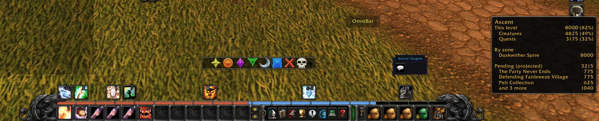
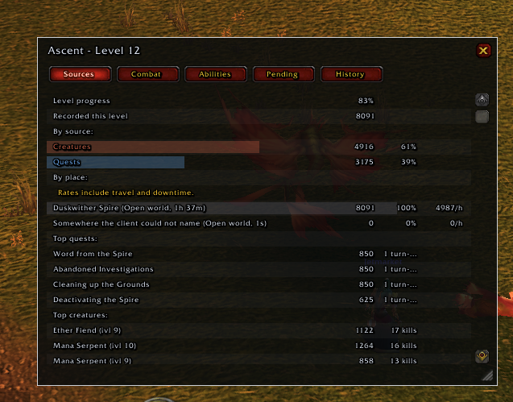
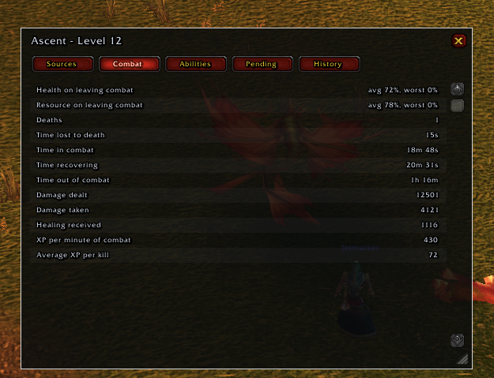
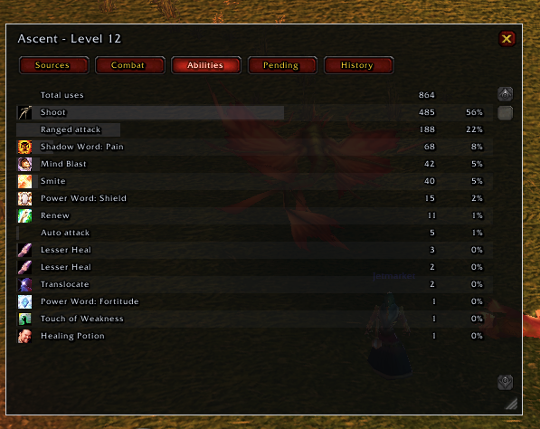
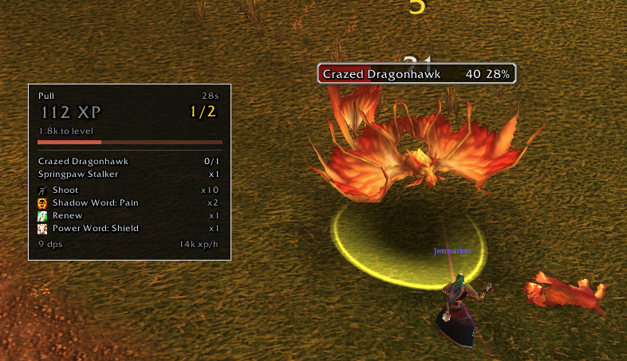

# CurseForge listing

Everything the project page needs, written to be pasted into the form rather than read here.
Screenshots live in `press/screenshots/`. Two of the four slots are filled from a real Burning
Crusade session on 2026-09-21; the ones still marked `[MISSING]` are what the page is waiting for.
The files named `defect-*` are NOT for the page — they are evidence, listed at the bottom.
Nothing in this file ships inside the addon.

---

## Project name

    Ascent

## Slug

    ascent

Check it at `curseforge.com/wow/addons/ascent` before submitting. Search on CurseForge puts anything
called "Ascent" next to the **Ascension** family of addons, which are for a private server and have
nothing to do with this one — that is a discoverability problem, not a naming collision, and the
summary below is what separates them.

## Summary

Small field, one sentence, no version numbers and no game name:

    Per-level leveling analytics: where every point of experience came from, where you earned it,
    and how you played to earn it.

## Categories

- Class: Addons
- Primary category: **Leveling** (matches `X-Category` in the TOC)
- Secondary, if the form allows them: Data Export, Unit Frames

## Licence

MIT (the repository carries `LICENSE`).

---

## Description

Paste from here down.

---

### Ascent

Every experience bar for Classic answers the present: how much is left, experience per hour, how much
rested you have. None of them keeps the past. The moment you ding, how you got there is gone — which
quests carried the level, how much of it you ground out, what that dungeon run was actually worth,
how much you lost to deaths and corpse runs.

Ascent keeps it. Level by level, for every character.

**The promise is arithmetic: the sources add up to exactly the experience of the level.** Anything
the client does not explain lands in a bucket that says so, instead of quietly disappearing into a
total. Where a number is an estimate, Ascent says it is an estimate. Where the client never told it
anything, it says that too.

`[RETAKE — see note 1 at the bottom: this was shot with every text field on, and the bar's text is
unreadable. Take it again with `/ascent options slot inset` and two or three fields.]`

`press/screenshots/01-bar-breakdown-tooltip.png` — the sources add up to the level exactly: 4825 + 3175 = 8000.

### The bar

A bar of its own, so Blizzard's is left alone — hide that one from the game's interface options if
you want. Each segment is a **source**, not one undifferentiated block:

- quests, creature kills, exploration, and whatever the client reported but never classified
- a rested marker over the stretch the bonus is still paying for
- a separate channel for **pending** experience: what your quest log would hand you right now
- a tooltip that breaks the level down by source, cross-reads it by place, and states plainly which
  part of the level it was not watching

Drag it, lock it, scale it, resize it. The position survives a reload and is pulled back onto the
screen if your resolution changes.

`press/screenshots/02-panel-sources.png`

### The level report

`/ascent panel` opens five tabs:

| Tab | What it answers |
|---|---|
| **Sources** | the level by source and by place, with the rested portion, the group bonus and the raid penalty |
| **Combat** | health and resource on leaving combat, deaths, time lost to them, time in combat versus downtime, damage and healing |
| **Abilities** | what you actually pressed, ranked, with auto-attacks kept separate |
| **Pending** | the experience sitting in your quest log, what is ready to hand in, and how many quests the client could not price |
| **History** | every level you have closed, selectable, comparable against the one before it |

`[MISSING — the History tab with several levels closed. Nothing captured yet: the character has
one level recorded, so the tab has nothing to compare. Needs a second ding.]`

Available meanwhile, and worth the page on their own:

### Six skins

Tabard, Cartographer, Stormwind, Glass, Telemetry and Phantom — each a complete look for the bar and
the panel alike: background, border, fill, separator, typography, accent. Pick one from the gallery
in the options panel and tune it axis by axis, or set the colour of each source by hand. There is a
high-contrast mode, and a motion scale that goes all the way down to zero if you would rather
nothing moved.

`[MISSING — the skin gallery. The captured options page (screenshots/06-options-page.png) is the
Skin page scrolled to the top, which shows the preview bar and the slot dropdown but not the six
skins side by side. Recapture with the gallery in frame.]`

### Commands

| Command | |
|---|---|
| `/ascent` | list the commands |
| `/ascent panel` | open or close the level report |
| `/ascent summary` | the current level's breakdown, in chat |
| `/ascent pending` | forecasted experience from the quests in progress |
| `/ascent options` | skin, scale, lock, contrast, motion, and the rest |
| `/ascent copy` | the diagnostics as selectable text, for a bug report |
| `/ascent reset confirm` | erase this character's recorded history |

The options panel also lives under **Interface → AddOns → Ascent**.

### Built for Classic, and only for Classic

Classic Era (1.15.x) and Burning Crusade Anniversary (2.5.x), from one file. No Ace3, no LibStub, no
external libraries at all — one folder of Lua, which is also why it starts fast and stays out of the
way.

Ascent makes **no network requests** and cannot: no addon can. There is no telemetry, no account, and
nothing is sent anywhere. Your history lives in your own saved variables, bounded by a retention
policy you control, and `/ascent reset confirm` erases it.

### This is an early beta

Said plainly, because you are the one who has to trust it with a levelling run:

- it has been played far less than it has been tested — the domain logic has a headless suite behind
  it, the interface has had far fewer hours in front of a real client
- the central promise, that the sources add up to exactly the level, has been verified in pieces and
  not yet across a full 1–60
- expect rough edges in the panel before you expect wrong numbers in the bar

If something looks wrong, that is worth reporting, and reporting it is one command: **`/ascent copy`**
opens a window with the diagnostics already selected — press Ctrl-C (Cmd-C on a Mac) and paste it
into a comment here. It carries the addon's build, your client's flavour and interface language, and
counters. It does **not** carry your character name or your realm, and you can edit it before you
send it.

---

## Upload form

- **File**: `dist/Ascent-<version>.zip`, built with `./dev.sh package` from a clean, committed tree.
  **Verified on 2026-09-21** against a tree exported from `HEAD`: one `Ascent/` folder at the root and
  nothing beside it, 115 entries, 904 KB, no `test/` file at all, and the 100 packaged `.lua` files
  match the 100 the TOC lists one for one. That is the shape CurseForge expects, so the upload needs
  no repackaging step of its own — build it the same way on the day.
- **Release type**: **Beta**. Not Release until the in-client verification is done.
- **Game versions**: tick both — Classic Era 1.15.x and Burning Crusade 2.5.x. The TOC declares
  `## Interface: 11509, 20506` from one file. If the CurseForge app installs it into only one
  flavour's folder, the fix is the standard one: split into `Ascent_Vanilla.toc` and `Ascent_TBC.toc`
  with the same file list.
- **Changelog**: paste the current section of `CHANGELOG.md`.
- **Logo**: `generated-images/ascent-logo-400.png`.
- **After the project exists**: add its id to the TOC as `## X-Curse-Project-ID: <id>`, which is also
  what the packager would need later.

Moderation is 48–72 hours, first in first out, reviewed 08:00–15:00 CET.

---

## Not for the page: what the same session showed

Kept here because they were found on the way to the screenshots, in the order I would fix them.

1. **`defect-bar-text-overlapping.png` — the bar's own text is unreadable.** Thirteen unlabelled
   values on one line, touching and in places overlapping: `12 8000 9800 82% 1800 0 21m 4920 3215
   1h 35m 177/h 6m`. In the client's slot the bar inherits about 12 pixels against its own 24, the
   text falls outside the frame, and the field-dropping that would save it only runs against the
   inside anchor — outside there is no width budget to trigger it. Still open.

   **How to photograph the bar today, without waiting for that.** Since `8454132` the inset slot
   leaves the client's own frame art alone (it was being switched off: the addon quieted the anchor,
   and on this client the anchor IS the container that owns the art). So `/ascent options slot inset`
   now shows Ascent's segments inside the client's own frame, which is a better screenshot than the
   loose bar ever was. Either way, leave two or three fields on in *What the bar says* first.
2. **`defect-pull-112xp.png` → `defect-pull-91xp.png` — a pull's experience went DOWN.** Same pull
   (the clock runs 32s → 34s, same two creatures, same `Shoot x13`), and the total fell from 112 XP
   to 91. Settling late experience should add, not subtract.
3. **`04-panel-abilities.png` — `Lesser Heal` appears twice** (3 uses and 2 uses). Two ranks of one
   spell, shown as two identical rows. Also worth a look on the same screen: `Shoot` (485) and
   `Ranged attack` (188) as separate rows for a priest with a wand — the recent fix says a wand shot
   is counted once, so either this level's stored data predates it or it is not finished.
4. **`02-panel-sources.png` — a row of zeroes**: `Somewhere the client could not name (Open world,
   1s) — 0, 0%, 0/h`. The pending-detail proposal already states the rule for the popup: in a block
   about where the experience came from, a row of zeroes is not an answer.
5. **`02-panel-sources.png` — `1 turn-...` is truncated** in the Top quests column.
